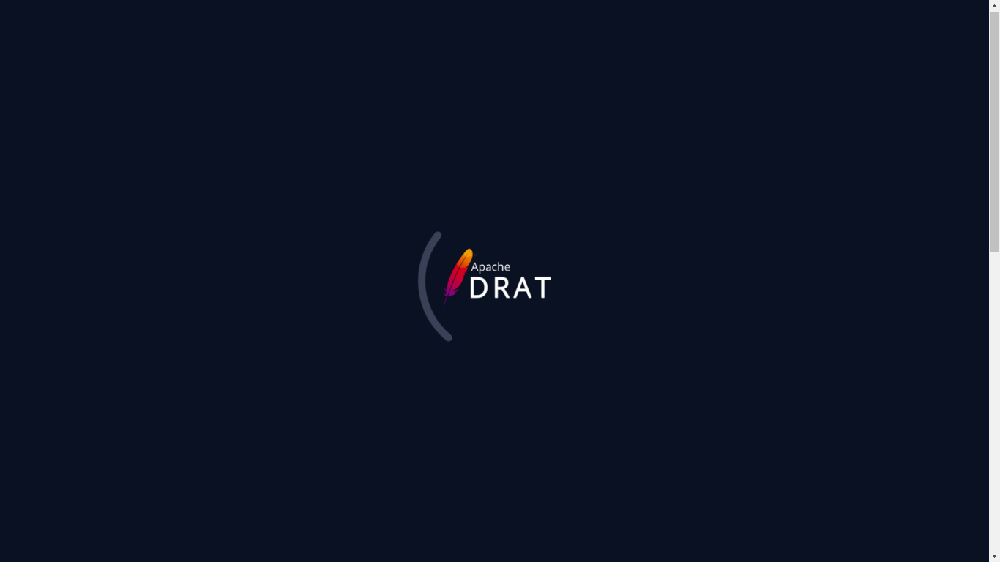
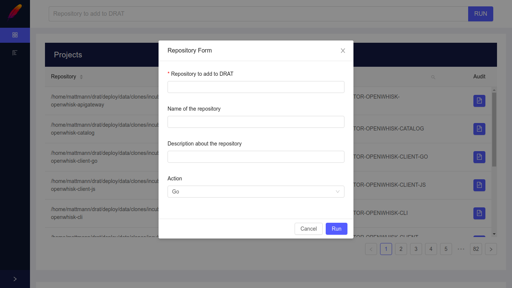
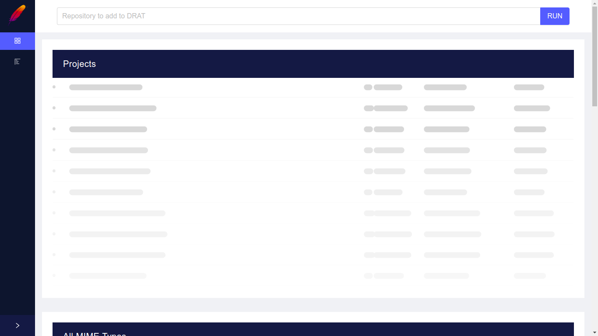
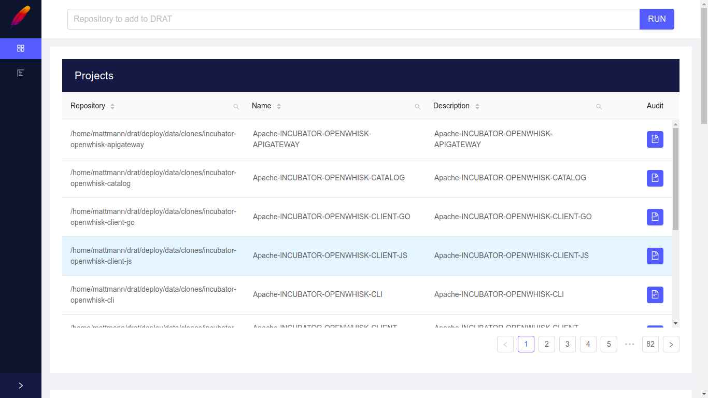
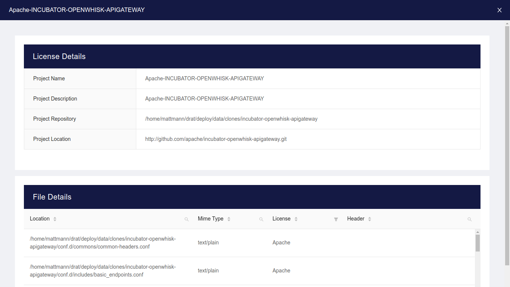
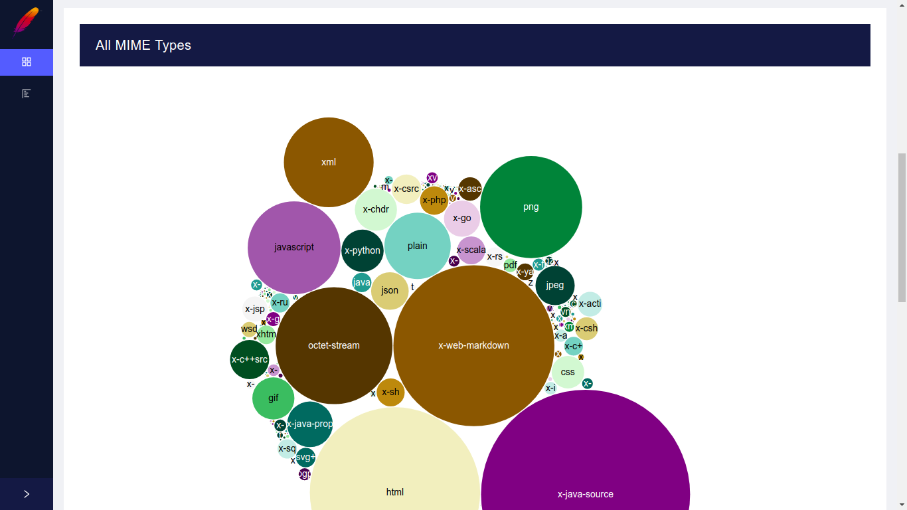
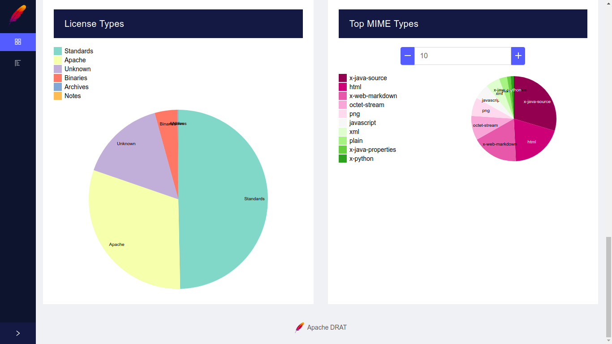
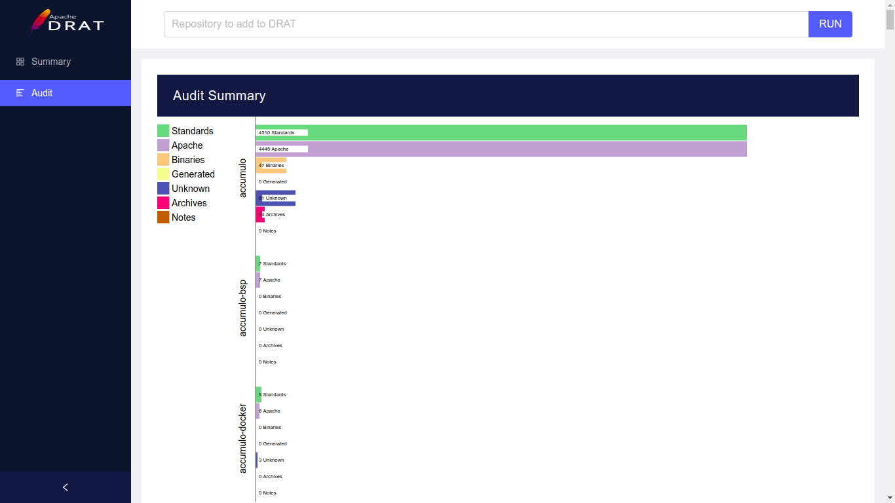

# Proteus a GUI for DRAT

### :exclamation::exclamation: This project is a proposed UI for the [Apache DRAT](https://github.com/apache/drat) project :exclamation::exclamation:

## Quick Start

First of all, install the dependencies to run this app.

- [NodeJS](http://nodejs.org/)
- [Yarn](https://yarnpkg.com/lang/en/docs/cli/install/) - _Optional_

```bash
# Install dependencies for app
$ yarn install (or npm i)

# Run the app
$ yarn start (or npm run start)

# The app runs on http://localhost:3000
```

## Screenshots

|  |  |
| :------------------------------------------------------------: | :------------------------------------------------------------: |
|                     **Splash Screen Page**                     |                   **Repository Form Dialog**                   |

|  |  |
| :------------------------------------------------------------: | :------------------------------------------------------------: |
|                   **Projects Table Loading**                   |                       **Projects Table**                       |

|  |  |
| :------------------------------------------------------------: | :------------------------------------------------------------: |
|                      **Projects Details**                      |                    **All MIME Types Chart**                    |

|  |  |
| :------------------------------------------------------------: | :------------------------------------------------------------: |
|          **License Types and Top MIME Types Charts**           |                     **Audit Summary Page**                     |
